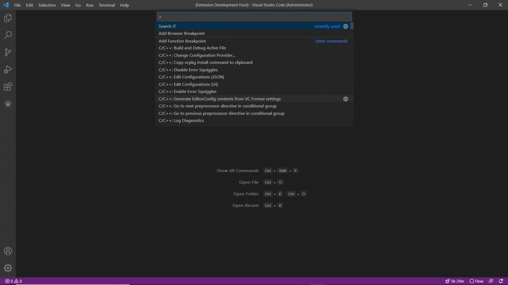

**Hey-Google**

I feel its an tedious job as an  **programmer** 🥶, 
searching out for small thing on google every time. 

For **example**: searching for an parsing function in javascript all that stuffs. So i made an simple extension for doing that kind of stuffs.

Its only for slight task. But still thinks its usefull. Hope you guys enjoy it.

And at last thanks @patneedham for providing google-it package, you guys can find it in [google-it](https://www.npmjs.com/package/google-it) 

**How to use it**

> Just `install it` and `CTRL+SHIFT+P`.
> Search for `Search iT`
> Start searching it 😀

**Enjoy!**
